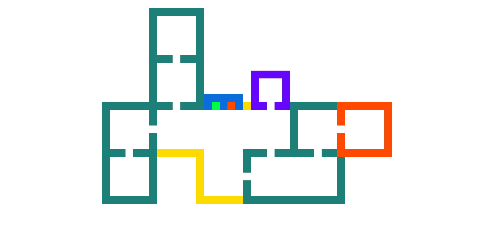

# RPG-Lineal-Survival
Videojuego desarrollado con fines completamente educativos basado en el ambiente universitario (UNINORTE) y un panorama post apocaliptico en el que muchos de los estudiantes han sido convertidos en zombies
### CARACTERISTICAS VISUALES
    Pixel Art
    Vista Top-Down
  
### CARACTERISTICAS DE JUEGO Y GAMEPLAY
#### Niveles de dificultad

El juego contara con los siguientes niveles de dificultad:
   - Normal
   - Dificil
   - Insano
Para desbloquear el modo insano es necesario desbloquear alguna mejora de arma.
#### Generacion aleatoria de mapas
Cada run esta dividida en 3 diferentes pisos cuya distribucion de salas internas sera generada de forma aleatoria, siguiendo unos parametros establecidos.

Ejemplo piso:

    
#### Generacion de enemigos
En cada sala se generaran grupos de enemigos con distintas secuencias de combate previamente establecidas
#### Mecanicas de Jefes
Cada jefe tendra un estilo de combate previamente establecido
#### Drop de articulos
Una vez completada una run se le otorgara al jugador un item aleatorio el cual podra utilizar para la creacion de nuevas armas de combate
#### Crafteos
Para desbloquear nuevas armas, es necesario combinar determinados articulos. el jugador podra seleccionar una de estas armas al inicio de cada partida dependiendo de su estilo de juego. 
#### Mejoras
completar una run en el modo dificil sin ser tocado mejorará de forma permanente el arma seleccionada, otorgando ciertas mejoras en lo que respecta su daño base y efectos de impacto, pero manteniendo la esencia de esta misma. de tal manera que el estilo de juego de dicha arma no cambie de forma drastica.
#### Habilidades pasivas
Durante el transcurso de cada partida, espesificamente en cada uno de  los pisos, el jugador si lo desea podra cambiar entre diferentes habilidades pasivas, que se pueden recolectar a modo de abalorios o amuletos.
#### Consumibles
Mismo funcionamiento que las pasivas (en lo que a obtencion se refiere) pero estas seran activables y con una cantidad de usos determinada.
#### Lenguaje Maduro
Lenguaje maduro...
